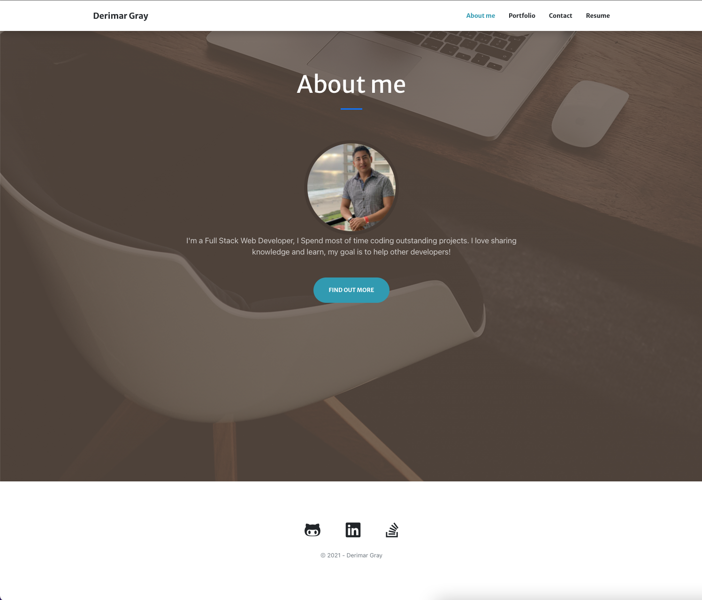
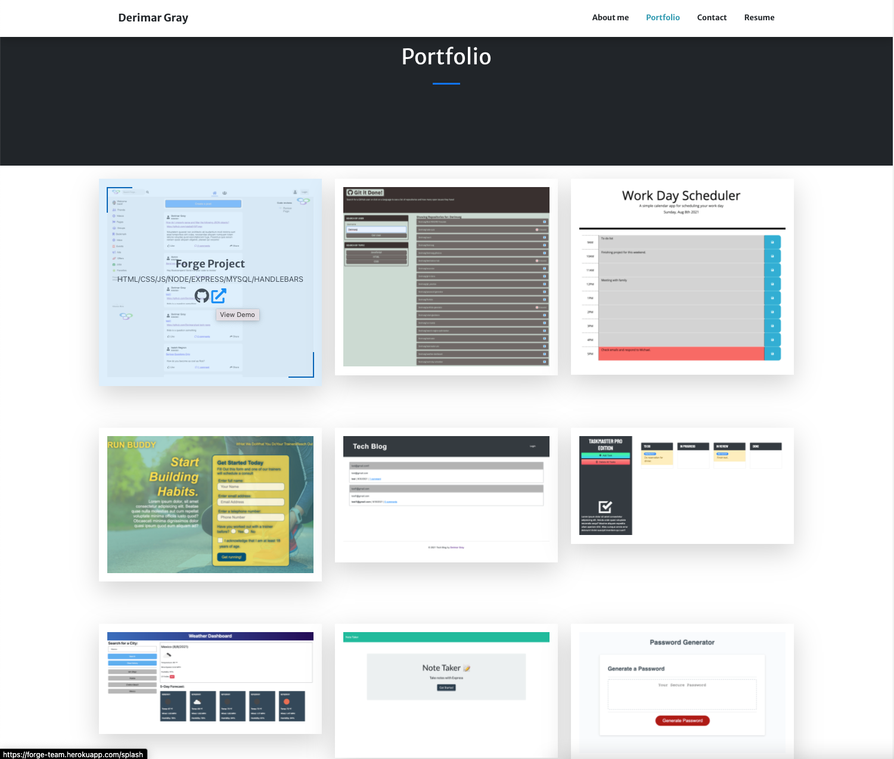
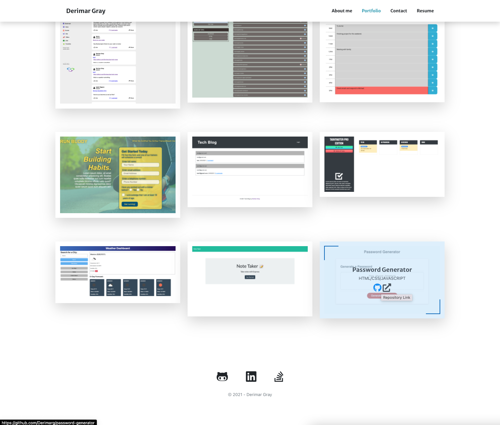
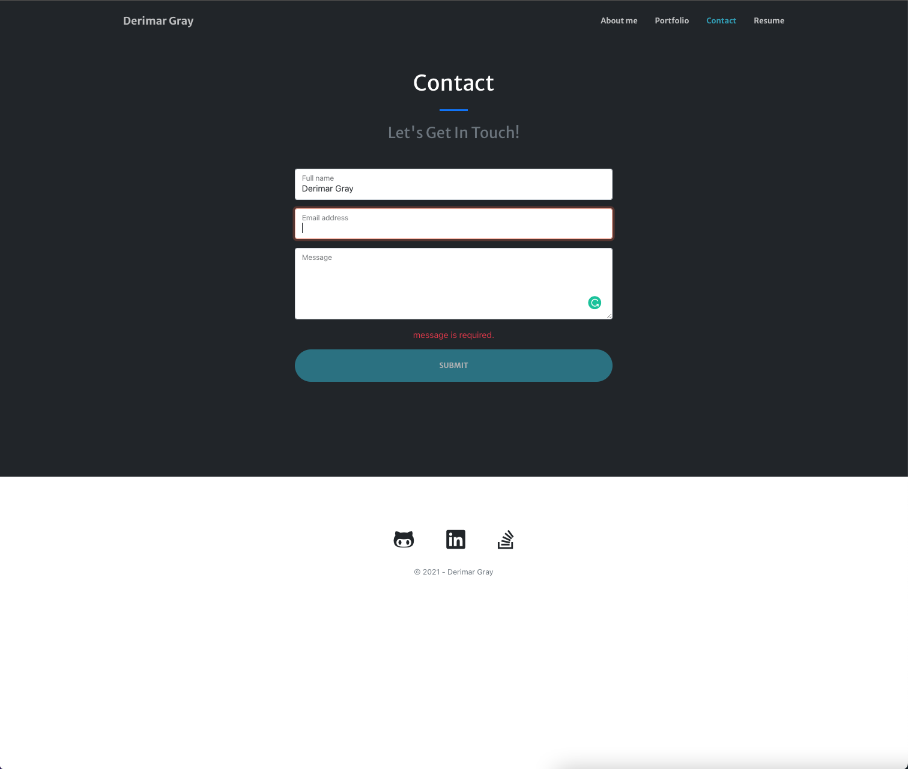
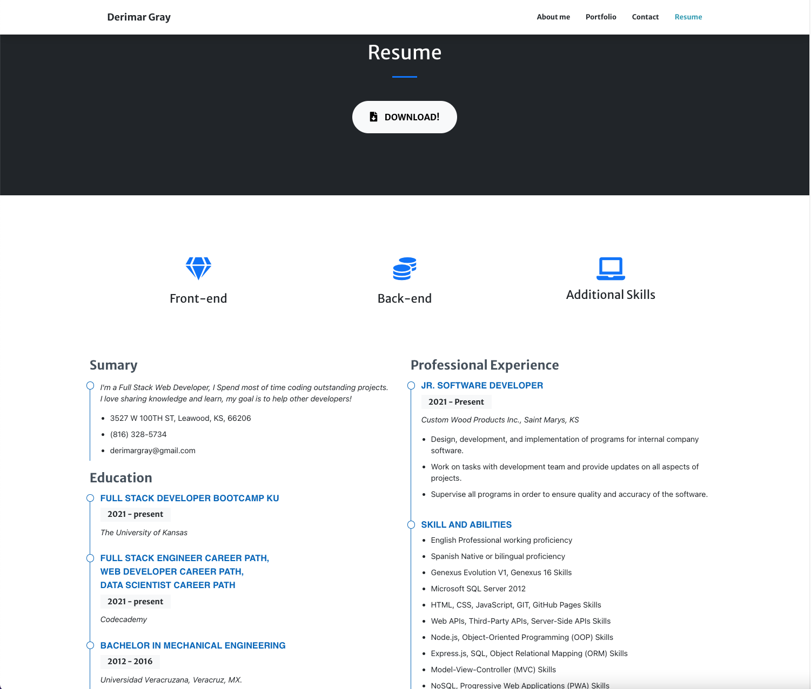
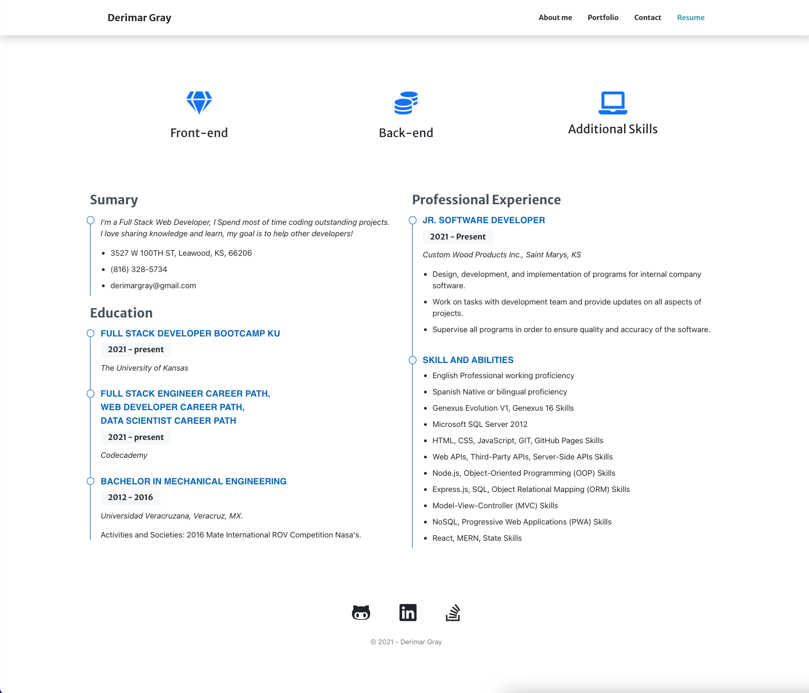

![Repo Size][repo-size]
![Language][github-language]
[![Contributors][contributors-shield]][contributors-url]
[![Forks][forks-shield]][forks-url]
[![Stargazers][stars-shield]][stars-url]
[![Issues][issues-shield]][issues-url]
[![LinkedIn][linkedin-shield]][linkedin-url]
![MIT License][license-shield]

<br />
<p align="center">

<h3 align="center" id="react-portfolio">React Portfolio</h3>

<p align="center">
As an employer looking for candidates with experience building single-page applications, <br/>I want to view a potential employee's deployed React portfolio of work samples, so that<br/> I can assess whether they're a good candidate for an open position.
<br />
<a href="#how-to-download"><strong>Explore the docs »</strong></a>
<br />
<br />
<a href="#example">View Demo</a>
.
<a href="https://github.com/Derimarg/react-portfolio/issues">Report Bug</a>
·
<a href="https://github.com/Derimarg/react-portfolio/issues">Request Feature</a>
</p>
</p>
<br />
<br />

> Link web page: http://Derimarg.github.io/react-portfolio

<details open="open">
<summary>Table of Contents</summary>
<ul>
<li><a href="#description">Description</a></li>
<li><a href="#technologies">Technologies</a></li>
<li><a href="#how-to-download">Download</a></li>
<li><a href="#installation">Installation</a></li>
<li><a href="#prerequisites">Prerequisites</a></li>
<li><a href="#usage">Usage</a></li>
<li><a href="#roadmap">Roadmap</a></li>
<li><a href="#contributing">Contributing</a></li>
<li><a href="#questions">Questions</a></li>
<li><a href="#license">License</a></li>
</ul>
</details>

---

## Description

This is a single-page application portfolio for a web developer, will follow the next conditions:

- Loading the portfolio, I will be presented with a page containing a header, a section for content, and a footer.

- Viewing the header, will be presented developer's name and navigation with titles corresponding to different sections of the portfolio.

- Viewing the navigation titles, will be presented the titles About Me, Portfolio, Contact, and Resume, and the title corresponding to the current section is highlighted.

- Clicking on a navigation title, will be presented the corresponding section below the navigation without the page reloading and that title is highlighted.

- Loading the portfolio the first time, the About Me title and section are selected by default.

- Being presented the About Me section, will see a recent photo or avatar of the developer and a short bio about them.

- Being presented the Portfolio section, will see titled images of six of the developer’s applications with links to both the deployed applications and the corresponding GitHub repository.

- Being presented with the Contact section, will see a contact form with fields for a name, an email address, and a message.

- Moving cursor out of one of the form fields without entering text, I will receive a notification that this field is required.

- Entering text into the email address field, I will receive a notification if I have entered an invalid email address.

- Being presented with the Resume section, will see a link to a downloadable resume and a list of the developer’s proficiencies.

- Viewing the footer, I am presented with text or icon links to the developer’s GitHub and LinkedIn profiles, and their profile on a third platform (Stack Overflow, Twitter).

<br />
<br />
<br/>

## Example

<br />

<h2 align="center">Mobile</h2>

<p align="center"></p>

<br/>
<br />

<h2 >Web</h2>

<br />



<br />



<br />



<br />



<br />



<br />



<br />

## Technologies

- <p><a href="https://nodejs.org/">Node.js</a></p>
- <p><a href="https://www.npmjs.com/">NPM</a></p>
- <p><a href="https://reactjs.org/docs/getting-started.html">React</a></p>
- <p><a href="https://getbootstrap.com/">Bootstrap</a></p>

[Back To Top](#react-portfolio)

---

## How to Download

- Simply copy the **SSH** to the terminal or Download the **ZIP File**:

## Installation

- Use the follow command at your terminal, **git clone** (Create a working copy at your local repository):

  ```
  git clone git@github.com:Derimarg/react-portfolio.git
  ```

- After cloned the repository, create your own repository, copy the files to your repository and type in your terminal the follow commands.

  ```
  git status

  git add -A

  git commit -m "Message to commit."

  git push or git push origin main
  ```

## Prerequisites

Before of using this application, is require to install dependencies, run the following command in your terminal:

```
npm i
```

[Back To Top](#react-portfolio)

---

## Usage

This is a open source program, feel free to use it, contact me to request features.

### `npm start`

Runs the app in the development mode.\
Open [http://localhost:3000](http://localhost:3000) to view it in the browser.

The page will reload if you make edits.\
You will also see any lint errors in the console.

### `npm run build`

Builds the app for production to the `build` folder.\
It correctly bundles React in production mode and optimizes the build for the best performance.

The build is minified and the filenames include the hashes.\
Your app is ready to be deployed!

See the section about [deployment](https://facebook.github.io/create-react-app/docs/deployment) for more information.

<!-- ROADMAP -->

## Roadmap

See the [open issues](https://github.com/Derimarg/react-portfolio/issues) for a list of proposed features (and known issues).

[Back To Top](#react-portfolio)

---

<!-- CONTRIBUTORS -->

## Contributing

Contributions are part of this open source project. Any contributions you make are **greatly appreciated**.

1. Fork the Project
2. Create your Feature Branch (`git checkout -b feature/name-of-feature`)
3. Commit your Changes (`git commit -m "Add some feature"`)
4. Push to the Branch (`git push origin feature/name-of-feature`)
5. Open a Pull Request

## Questions

For additional help or questions about collaboration, contact me at: derimargray@gmail.com

- GitHub - [Derimarg](https://github.com/Derimarg/)
- Linkedin - [Derimar Gray](https://www.linkedin.com/in/derimar-gray-676275132/)
- Project Repository Link: https://github.com/Derimarg/react-portfolio

[Back To Top](#react-portfolio)

---

## License

MIT License

Copyright (c) 2021 Derimar Gray

Permission is hereby granted, free of charge, to any person obtaining a copy
of this software and associated documentation files (the "Software"), to deal
in the Software without restriction, including without limitation the rights
to use, copy, modify, merge, publish, distribute, sublicense, and/or sell
copies of the Software, and to permit persons to whom the Software is
furnished to do so, subject to the following conditions:

The above copyright notice and this permission notice shall be included in all
copies or substantial portions of the Software.

THE SOFTWARE IS PROVIDED "AS IS", WITHOUT WARRANTY OF ANY KIND, EXPRESS OR
IMPLIED, INCLUDING BUT NOT LIMITED TO THE WARRANTIES OF MERCHANTABILITY,
FITNESS FOR A PARTICULAR PURPOSE AND NONINFRINGEMENT. IN NO EVENT SHALL THE
AUTHORS OR COPYRIGHT HOLDERS BE LIABLE FOR ANY CLAIM, DAMAGES OR OTHER
LIABILITY, WHETHER IN AN ACTION OF CONTRACT, TORT OR OTHERWISE, ARISING FROM,
OUT OF OR IN CONNECTION WITH THE SOFTWARE OR THE USE OR OTHER DEALINGS IN THE
SOFTWARE.

[repo-size]: https://img.shields.io/github/repo-size/Derimarg/react-portfolio?style=for-the-badge
[github-language]: https://img.shields.io/github/languages/top/Derimarg/react-portfolio?color=yellow&style=for-the-badge
[contributors-shield]: https://img.shields.io/github/contributors/Derimarg/react-portfolio.svg?style=for-the-badge
[contributors-url]: https://github.com/Derimarg/react-portfolio/graphs/contributors
[forks-shield]: https://img.shields.io/github/forks/Derimarg/react-portfolio.svg?color=9cf&style=for-the-badge
[forks-url]: https://github.com/Derimarg/react-portfolio/network/members
[stars-shield]: https://img.shields.io/github/stars/Derimarg/react-portfolio.svg?color=blueviolet&style=for-the-badge
[stars-url]: https://github.com/Derimarg/react-portfolio/stargazers
[issues-shield]: https://img.shields.io/github/issues/Derimarg/react-portfolio.svg?style=for-the-badge
[issues-url]: https://github.com/Derimarg/react-portfolio/issues
[license-shield]: https://img.shields.io/static/v1?label=license&message=MIT&color=yellowgreen.svg&style=for-the-badge
[linkedin-shield]: https://img.shields.io/badge/-LinkedIn-black.svg?style=for-the-badge&logo=linkedin&colorB=555
[linkedin-url]: https://www.linkedin.com/in/derimar-gray-676275132/
